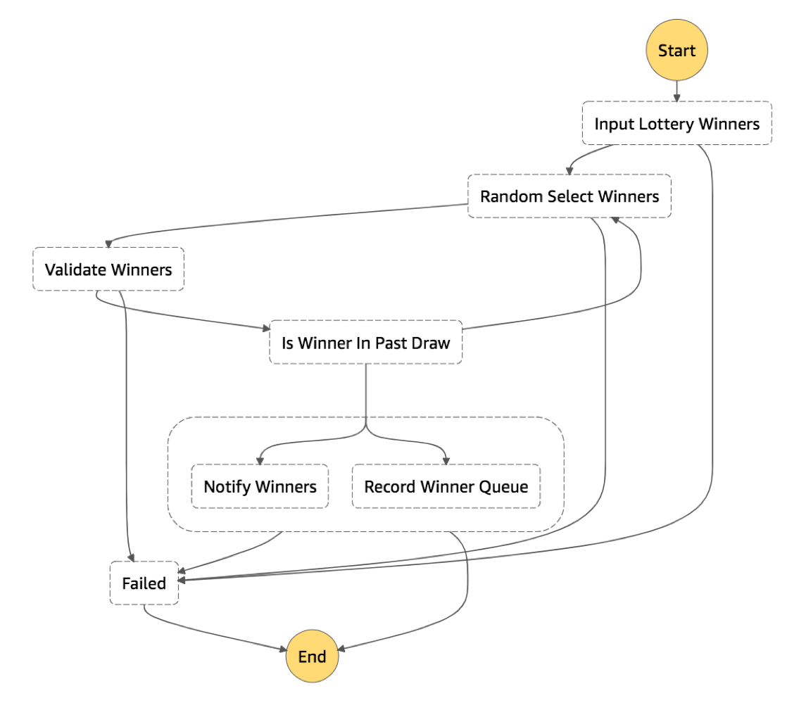

# aws-serverless-lottery
在本次实验中，我们将会通过AWS Serverless应用构建一个无服务器化的抽奖程序。本次的实验涉及到的服务有：
- [AWS Lambda](https://aws.amazon.com/lambda/)
- [Amazon API Gateway](https://aws.amazon.com/api-gateway/)
- [AWS Step Functions](https://aws.amazon.com/step-functions/)
- [Amazon SNS](https://aws.amazon.com/sns/)
- [Amazon Dynamodb](https://aws.amazon.com/dynamodb/)


## 前提条件
- 本文实验基于AWS中国区宁夏区(cn-northwest-1)作示例。所有控制台链接均直接连接到北京区console。如使用海外区账号，请不要点击此直达连接，在global控制台选择相应产品即可。
- 如果您使用的是AWS中国区账号，账号默认屏蔽了80,8080,443三个端口，需要先申请打开443端口才可以正常使用API Gateway的服务。如果是海外账号，没有此限制。
- 如何判断自己的账号是中国区账号还是海外区账号？请查看自己的控制台链接，console.amazonaws.cn为中国区，console.aws.amazon.com为海外区账号。
- 在`Identiy Access Management`服务中创建一个本次实验需要用到的`AWS Lambda`服务角色，包含本次实验需要使用到的服务权限。角色包含如下四个托管的策略
  - AmazonDynamoDBFullAccess
  - AWSLambdaBasicExecutionRole
  - AmazonSNSFullAccess
  - AWSStepFunctionsFullAccess
  
具体的角色创建流程，可以参考如下连接
[AWS Lambda Execution Role](https://docs.aws.amazon.com/lambda/latest/dg/lambda-intro-execution-role.html)
[Creating a Role to Delegate Permissions to an AWS Service](https://docs.aws.amazon.com/IAM/latest/UserGuide/id_roles_create_for-service.html)


## Architecture


## Workflow Overview


## 详细步骤

### 创建AWS Step Functions 状态机

1. 进入AWS控制台，在`服务`中搜索`Step Functions`
2. 进入`Step Functions`服务后，点击左侧的活动栏，并点击`状态机`
3. 进入`状态机`主页面后，选择`创建状态机`
4. 在`定义状态机`栏目下，选择默认`使用代码段创作`。同时在`详细信息`栏目输入状态机名称`Lottery`
5. 在`状态机定义`栏目下，复制如下状态机定义文件，通过`Amazon States Language`来定义状态机的状态流转
```
{
  "Comment": "A simple AWS Step Functions state machine that simulates the lottery session",
  "StartAt": "Input Lottery Winners",
  "States": {
    "Input Lottery Winners": {
        "Type": "Task",
        "Resource": "<InputWinners:ARN>",
        "ResultPath": "$",
        "Catch": [ 
            {          
              "ErrorEquals": [ "CustomError" ],
              "Next": "Failed"      
            },
            {          
              "ErrorEquals": [ "States.ALL" ],
              "Next": "Failed"      
            } 
          ],
        "Next": "Random Select Winners"
    }, 
    "Random Select Winners": {
      "Type": "Task",
      "InputPath": "$.body",
      "Resource": "<RandomSelectWinners:ARN>",
      "Catch": [ 
        {          
          "ErrorEquals": [ "States.ALL" ],
          "Next": "Failed"      
        } 
      ],      
     "Retry": [ 
        {
          "ErrorEquals": [ "States.ALL"],          
          "IntervalSeconds": 1, 
          "MaxAttempts": 2
        } 
      ],
      "Next": "Validate Winners"
    },
    "Validate Winners": {
      "Type": "Task",
      "InputPath": "$.body",
      "Resource": "<ValidateWinners:ARN>",
      "Catch": [ 
        {          
          "ErrorEquals": [ "States.ALL" ],
          "Next": "Failed"      
        } 
      ],      
     "Retry": [ 
        {
          "ErrorEquals": [ "States.ALL"],          
          "IntervalSeconds": 1, 
          "MaxAttempts": 2
        } 
      ],
      "Next": "Is Winner In Past Draw"
    },
    "Is Winner In Past Draw": {
      "Type" : "Choice",
        "Choices": [
          {
            "Variable": "$.status",
            "NumericEquals": 0,
            "Next": "Send SNS and Record In Dynamodb"
          },
          {
            "Variable": "$.status",
            "NumericEquals": 1,
            "Next": "Random Select Winners"
          }
      ]
    },
    "Send SNS and Record In Dynamodb": {
      "Type": "Parallel",
      "End": true,
      "Catch": [ 
        {          
          "ErrorEquals": [ "States.ALL" ],
          "Next": "Failed"      
        } 
      ],      
     "Retry": [ 
        {
          "ErrorEquals": [ "States.ALL"],          
          "IntervalSeconds": 1, 
          "MaxAttempts": 2
        } 
      ],
      "Branches": [
        {
         "StartAt": "Notify Winners",
         "States": {
           "Notify Winners": {
             "Type": "Task",
             "Resource": "arn:aws:states:::sns:publish",
             "Parameters": {
               "TopicArn": "<Notification:ARN>",
               "Message.$": "$.sns"
             },
             "End": true
           }
         }
       },
       {
         "StartAt": "Record Winner Queue",
         "States": {
           "Record Winner Queue": {
             "Type": "Task",
             "InputPath": "$.body",
             "Resource":
               "<RecordWinners:ARN>",
             "TimeoutSeconds": 300,
             "End": true
           }
         }
       }
      ]
    },
    "Failed": {
        "Type": "Fail"
     }
  }
}
```
6. 在`状态机定义`栏目的右侧，点击`刷新`按钮，可以看到状态机流转的流程图。点击`下一步`
7. 在`配置设置`下，选择`为我创建IAM角色`, 输入自定义的IAM角色名称`MyStepFunctionsExecutionRole`
8. 点击`创建状态机`完成创建过程

### 创建AWS Lambda任务
为了实现`Step Functions`状态机流转下的任务，我们这次实现会用到`AWS Lambda`作为我们业务的实现环境

1. 进入AWS控制台，选择`服务`然后输入`Lambda`进入`AWS Lambda`控制台
2. 选择`创建函数`，然后选择`从头开始创作`来自定义我们的实验程序
3. 首先我们需要创建状态机中的第一个状态任务`Input Lottery Winners`，输入函数名称`Lottery-InputWinners`来定义幸运儿的数量。运行语言选择`Python 3.7`。同时需要选择函数执行的权限, 这里我们选择`使用现用角色`，选择我们在`前提条件`下创建的`IAM`角色
4. 点击`创建函数`
5. 在`函数代码`栏目下输入如下代码块
```
import json

class CustomError(Exception):
    pass

def lambda_handler(event, context):
    num_of_winners = event['input']
    
    # Trigger the Failed process
    if 'exception' in event:
        raise CustomError("An error occurred!!")
    
    return {
        "body": {
            "num_of_winners": num_of_winners
        }
    }
```
6. 点击右上角的`保存`
7. 保存成功后复制页面右上角的`ARN`，替换原`Step Functions`状态机定义下的`<InputWinners:ARN>`

接下来我们还需要创建另外三个需要定义的状态机业务逻辑，创建过程和上面的`Lottery-InputWinners`一致，下面是具体的状态机`AWS Lambda`代码块

`Lottery-RandomSelectWinners` 代码块
```
import json
import boto3
from random import randint
from boto3.dynamodb.conditions import Key, Attr

TOTAL_NUM = 10

def lambda_handler(event, context):
    # variables
    num_of_winners = event['num_of_winners']
    
    # query in dynamodb
    dynamodb = boto3.resource('dynamodb', region_name='cn-northwest-1')
    table = dynamodb.Table('Lottery-Employee')

    # random select the winners, if has duplicate value, re-run the process
    while True:
        lottery_serials = [randint(1,TOTAL_NUM) for i in range(num_of_winners)]
        if len(lottery_serials) == len(set(lottery_serials)):
            break
    
    # retrieve the employee details from dynamodb
    results = [table.query(KeyConditionExpression=Key('lottery_serial').eq(serial), IndexName='lottery_serial-index') for serial in lottery_serials]
    
    # format results
    winner_details = [result['Items'][0] for result in results]
    
    return {
        "body": {
            "num_of_winners": num_of_winners,
            "winner_details": winner_details
        }
    }
```
保存成功后复制页面右上角的`ARN`，替换原`Step Functions`状态机定义下的`<RandomSelectWinners:ARN>`

`Lottery-ValidateWinners`代码块
```
import json
import boto3
from boto3.dynamodb.conditions import Key, Attr

def lambda_handler(event, context):
    # variables
    num_of_winners = event['num_of_winners']
    winner_details = event['winner_details']
    
    # query in dynamodb
    dynamodb = boto3.resource('dynamodb', region_name='cn-northwest-1')
    table = dynamodb.Table('Lottery-Winners')

    # valiate whether the winner has already been selected in the past draw
    winners_employee_id = [winner['employee_id'] for winner in winner_details]
    results = [table.query(KeyConditionExpression=Key('employee_id').eq(employee_id)) for employee_id in winners_employee_id]
    output = [result['Items'] for result in results if result['Count'] > 0]
    
    # if winner is in the past draw, return 0 else return 1
    has_winner_in_queue = 1 if len(output) > 0 else 0
    
    # format the winner details in sns
    winner_names = [winner['employee_name'] for winner in winner_details]
    
    name_s = ""
    for name in winner_names:
        name_s += name
        name_s += " "
        
    return {
        "body": {
            "num_of_winners": num_of_winners,
            "winner_details": winner_details
        },
        "status": has_winner_in_queue,
        "sns": "Congrats! [{}] You have selected as the Lucky Champ!".format(name_s.strip())
    }
```
保存成功后复制页面右上角的`ARN`，替换原`Step Functions`状态机定义下的`<ValidateWinners:ARN>`

`Lottery-RecordWinners` 代码块
```
import json
import boto3
from boto3.dynamodb.conditions import Key, Attr

def lambda_handler(event, context):
    # variables
    winner_details = event['winner_details']
    
    # retrieve the winners' employee id
    employee_ids = [winner['employee_id'] for winner in winner_details]
    
    # save the records in dynamodb
    dynamodb = boto3.resource('dynamodb', region_name='cn-northwest-1')
    table = dynamodb.Table('Lottery-Winners')
    
    for employee_id in employee_ids:
        table.put_item(Item={
            'employee_id': employee_id
        })
        
    return {
        "body": {
            "winners": winner_details
        },
        "status_code": "SUCCESS" 
    }
```
保存成功后复制页面右上角的`ARN`，替换原`Step Functions`状态机定义下的`<RecordWinners:ARN>`

### 创建AWS SNS 通知服务
1. 进入AWS控制台，在`服务`中搜索`SNS`
2. 在`SNS`控制面板中，选择`主题`, 然后选择`创建主题`
3. 在`创建新主题`弹框中，输入
  - 主题名称: `Lottery-Notification`
  - 显示名称: `Lottery`
4. 创建主题后，会进入`主题详细信息`页面，这时候我们需要创建`订阅`来对接我们的消息服务，例如邮件服务（本次实验使用邮件服务来作为消息服务）
5. 点击`创建订阅`, 在弹框中选择
  - 协议: `Email`
  - 终端节点: `<填入自己的邮箱地址>`
6. 点击`请求确认`, 然后到上面填写的邮箱地址中确认收到信息，表示确认该邮箱可以接收来自`AWS SNS`该主题的通知消息
7. 复制主题详细页面的`主题ARN`，替换`Step Functions`状态机下的`<Notification:ARN>`


### 创建Amazon Dynamodb 服务
本次实验需要创建两张`Dynamodb`表来记录员工信息和幸运儿信息。使用`Dynamodb`能更快地通过托管的方式记录数据同时免去数据库运维的压力。

1. 进入AWS控制台，在`服务`中搜索`Dynamodb`
2. 在左侧控制栏中选在`表`, 然后在主页面中选择`创建表`
3. 在`创建Dynamodb表`中，填入如下信息
   - 表名称：`Lottery-Winners`
   - 主键：`employee_id`
4. `表设置`中确认勾选`使用默认设置`,点击`创建`
5. 同样的设置步骤，点击`创建表`,在`创建Dynamodb表`中，填入如下信息
   - 表名称：`Lottery-Employee`
   - 主键：`employee_id`
6. `表设置`中确认勾选`使用默认设置`,点击`创建`
7. 等待表创建完成后, 通过本repo中的`request-items.json`文件导入数据到`Lottery-Employee`
```
$ aws dynamodb batch-write-item --request-items file://request-items.json
```

## 参考

